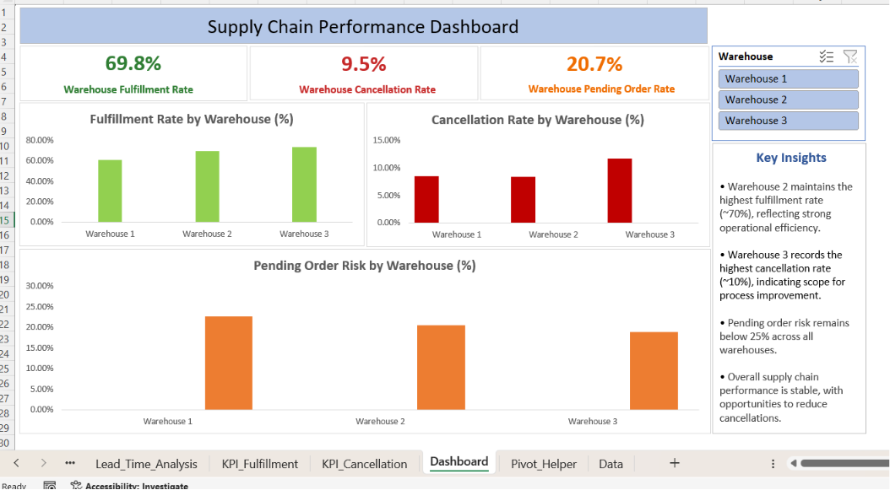

# 📦 Supply Chain & Logistics Performance Analytics

An end-to-end Supply Chain Analytics project built using **Excel**, **Pivot Tables**, **Pivot Charts**, and **Interactive Dashboarding** to monitor warehouse performance, order fulfillment, cancellations, and pending order risk.

The project transforms raw logistics data into actionable business insights that help identify operational bottlenecks and improve warehouse efficiency.

---

# 📊 Dashboard Preview

<p align="center">
  
</p>

---

# 🚀 Project Overview

This project focuses on analyzing logistics and warehouse performance using operational data. The dashboard enables users to monitor important KPIs, compare warehouse performance, and identify areas requiring operational improvements.

The analysis includes:

- Warehouse Fulfillment Performance
- Order Cancellation Analysis
- Pending Order Risk Analysis
- Warehouse-wise KPI Comparison
- Interactive Warehouse Filtering
- Business Insights Generation

---

# 📈 Key Performance Indicators (KPIs)

| KPI | Value |
|------|-------|
| Warehouse Fulfillment Rate | 69.8% |
| Warehouse Cancellation Rate | 9.5% |
| Warehouse Pending Order Rate | 20.7% |

---

# 📊 Dashboard Features

✅ Interactive Warehouse Slicer

✅ KPI Cards

✅ Fulfillment Rate by Warehouse

✅ Cancellation Rate by Warehouse

✅ Pending Order Risk by Warehouse

✅ Dynamic Business Insights Panel

---

# 💡 Key Insights

- Warehouse 2 maintains the highest fulfillment rate (~70%), indicating strong operational efficiency.
- Warehouse 3 records the highest cancellation rate (~10%), suggesting opportunities for process improvement.
- Pending order risk remains below 25% across all warehouses.
- Overall supply chain performance is stable with scope for reducing cancellations and improving order fulfillment.

---

# 🛠️ Tools & Technologies

- Microsoft Excel
- Pivot Tables
- Pivot Charts
- Slicers
- Conditional Formatting
- KPI Cards
- Data Cleaning
- Business Analytics

---

# 📂 Repository Structure

```
Supply-Chain-and-Logistics-Performance-Analytics
│
├── images/
│   └── dashboard.png
│
├── Supply_Chain_Performance_Dashboard.xlsx
├── Delivery_Logistics.csv
├── analysis.csv
├── supply_chain_cleaned.csv
├── supply_chain_analysis.sql
├── supply_chain_kpis.csv
├── data_cleaning_and_analysis.ipynb
└── README.md
```

---

# 📁 Dataset

The dataset contains warehouse logistics records including:

- Warehouse
- Orders
- Delivered Orders
- Cancelled Orders
- Pending Orders
- Delivery Status

The data was cleaned and transformed before dashboard development.

---

# 📌 Project Workflow

```
Raw Logistics Data
        │
        ▼
Data Cleaning
        │
        ▼
KPI Calculation
        │
        ▼
Pivot Tables
        │
        ▼
Pivot Charts
        │
        ▼
Interactive Dashboard
        │
        ▼
Business Insights
```

---

# 🎯 Business Value

This dashboard helps stakeholders:

- Track warehouse performance
- Monitor operational KPIs
- Identify high-risk warehouses
- Reduce cancellation rates
- Improve fulfillment efficiency
- Support data-driven decision making

---

# ▶️ How to Use

1. Download the repository.
2. Open **Supply_Chain_Performance_Dashboard.xlsx** in Microsoft Excel.
3. Enable editing if prompted.
4. Use the **Warehouse slicer** to filter the dashboard interactively.
5. Analyze KPI cards, charts, and insights.

---

# 📷 Dashboard Highlights

- Interactive Excel Dashboard
- Warehouse-wise Performance Tracking
- Business KPI Monitoring
- Executive Summary View

---

# 👨‍💻 Author

**Devendra Kumar**

- GitHub: https://github.com/DevendraKumar577

---

## ⭐ If you found this project useful, consider giving it a Star!
